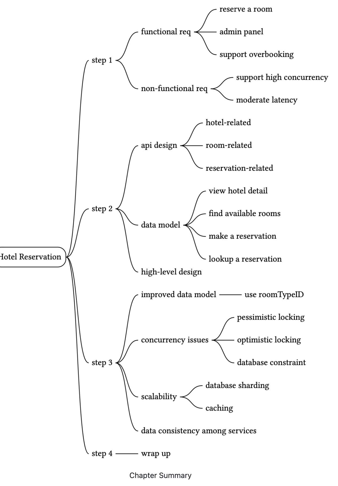

# 23. Hotel Reservation System

<br><br><br>

## step 1 - Understand the problem and establish design scope

<br><br>

### Functional Requirements
1. show the hotel-related page
2. show the hotel room-related detail page
3. reserve a room
4. admin panel to add/remove/update hotel or room info
5. support the overbooking feature

<br><br>

### Non-Functional Requirements
1. high concurrency
2. moderate latency

<br><br>

### back-of-the-envelope estimation
1. 500 hotels and 1 million rooms
2. 70% rooms are occupied the average stay duration is 3 days
3. estimated daily reservations (1m * 0.7) / 3 = 233,333 (~ 240,000)
4. reservations per second = 240,000 / 10^5 = 3. the average reservation txn per second (TPS) is not high

<br><br>

- typical customer flow
    1. view hotel/ room detail page. browse this page
    2. view the booking page. confirm booking details, dates, # of guests, payment info
    3. reserve a room. click `book` button
- assume 10% of the users will reach to next step, 990 % of users drop off the flow
- 


<br><br><br>

## step 2 - Propose high-level design and get buy-in

<br><br>

## 2.1 API design

<br><br>

## 2.2 Data Model
1. choose relational database
    - works well with read-heavy and write less frequently workflows
    - provides ACID (atomicity, consistency, isolation, durability) gurantees.
        - if no ACID, it will face negative balance, double charge, double reservations
    - easily model the data. structure of biz data is very clear and relationship between different entites(hotel, room, room_type) is stable

2. Airbnb assign a room_id when user books a room, but in general we just reverse a type of room

## 2.3 High level desgin

1. Public API gateway
    - fully managed service that supports rate limiting, authentication, etc.
2. Internal API gateway
    - accessible through internal software or websites, further protected by a VPN
3. Rate Service
    - price of a room depends on how full the hotel is expected to be on a given day


<br><br><br>

## step 3 - Design Deep Dive

### 3.1 Improved Data Model

<br><br>

### 3.2 Concurrentcy issues

#### 3.2.1 same user click twice
1. client-side implementataion. gray out, hide `submit` button once user click it
2. Idempotent APIs. an API call is idempotent if it produces the same result no matter how many times it is called. `idempotency key` (reservation_id) to avoid double-reservation issue.
    - 

<br><br>

#### 3.2.2 multipleusers try to book the same room at the same time
1. both txn succeeded
    - 
    

- Fixing:
    1. pessimistic locking (悲观锁)

    2. optimistic locking (乐观锁)
    
    3. database constraints

- pesudo code of checking available and reserve a room
```sql
-- (1) check availability
SELECT date, total_inventory, total_reserved
FROM room_type_inventory
WHERE room_type_id = ${room_type_id} AND hotel_id = ${hotel_id}
    AND date between ${start_date} and ${end_date}


-- (2) if larger than 100% rollback
if (total_reserve + ${numberOfRoomsToReserve}) > 110% * total_inventory {
    ROLLBACK
}

-- (3) reserve a room
UPDATE room_type_inventory
SET total_reserved = total_reserved + ${numberOfRoomsToReserve}
WHERE room_type_id = ${room_type_id} AND hotel_id = ${hotel_id}
    AND date between ${start_date} and ${end_date}

-- (4) commit
COMMIT
```

<br><br>

##### Option 1 pessimistic locking
- also called pessimistic concurrency control. prevents simultaneous updates by placing a lock on a record as soon as one user starts to update it
```sql
-- check below statement to lock rows returned by a selection query
sELECT ... FOR UPDATE 
```
- 

- Pros
    - prevents app from updating data is being - or has been - changed
    - easy to implement
- Cons
    - deadlocks. user 1 locks record A, user 2 locks record B, then user 1 tries to lock record B and user 2 tries to lock record A
    - not scalable. if a txn locked for too long, other txns cannot access the resource

<br><br>

##### Option 2 optimistic locking
- implement a version number
    - update version number after a successful update
    - check version number if not increased by 1
    - 

- Pros
    - prevents app from editing stale data
    - no need lock the db resource
    - generally used when data contention is low
- Cons
    - performance is poor when data contention is high  


<br><br>

##### Option 3 database constraints
```sql
-- add db constraint
CONSTRAINT `check_room_count` CHECK((`total_inventory - total_reserverd` >= 0 ))
```
- when use 2 trise to reserver room, the check fail, then rollback
    - 
    
    

- Pros
    - easy to implement
    - works well when data contention is low
- Cons  
    - can be result in high volume of failures
    - db constaints cannot be version-controlled easily like application code
    - not all db support constaints


### 3.3 Scaling the system
- if it's for booking or expedia, QPS could be 1000 = 86.4M/day, if one person make 10 query a day, 8.6M DAU users
1. what might be the bottlenecks?
    - all our service are stateless, so they can easily scale horizontally
    - `but databases contain state`, it cannot easily just add more servers to scale

<br><br>

#### 3.3.1 Database sharding
1. spread 16 shards, if QPS is 30,000, each shard handles 1875 QPS, within single MySQL server's load capacity


#### 3.3.2 Caching
1. hotel inventory only keep current and future hotel inventory data
    - redis TLL and LRU policy can make optimal use of memory

2. component analysis
    - reservation service
    - inventory cache
        - need pre-populate inventory data to the cache 
        ```sql
        key: hotelID_roomTypeID_{date}
        value: the number of available rooms for the given hotel id, root type id and date
        ```
    - inventory DB

3. New challenges posed by the cache
    - how to maintain data consistency between the cache and the database?
    - happy pass is when user resever a room, db updated, then update cache
    - but there is a possibility that the cache does not reflect to the latest inventory data
        - cache says availalbe, when user try to book, check db, not available -> display user room is not available

- Pros
    - reduced db load
    - high performance

- Cons
    - maintain data consistency between db and cache is hard

<br><br>

### 3.4 Resolving data inconsistency in the microservice architecture

- industry-proven techniques:
    1. two-phase commit (2PC), either all nodes succeed or all nodes failed
    2. saga. a sequence of local transactions. each local transaction updates the db and publishes a message or event to trigger the next local transaction in the saga. if a local transaction fails, the saga executes a series of compensating transactions that undo the changes that were made by the preceding local transactions


<br><br><br>

## step 4 - Wrap up
- 

<br><br><br>

# Tips:
1. stateless service: a system or component that does not store any information about the current state of a user or system between transactions.
2. redis: 1M qps
3. mysql: 1k ~ 3k qps
4. Debezium: an open source distributed platform for change data capture. Start it up, point it at your databases, and your apps can start responding to all of the inserts, updates, and deletes that other apps commit to your databases.