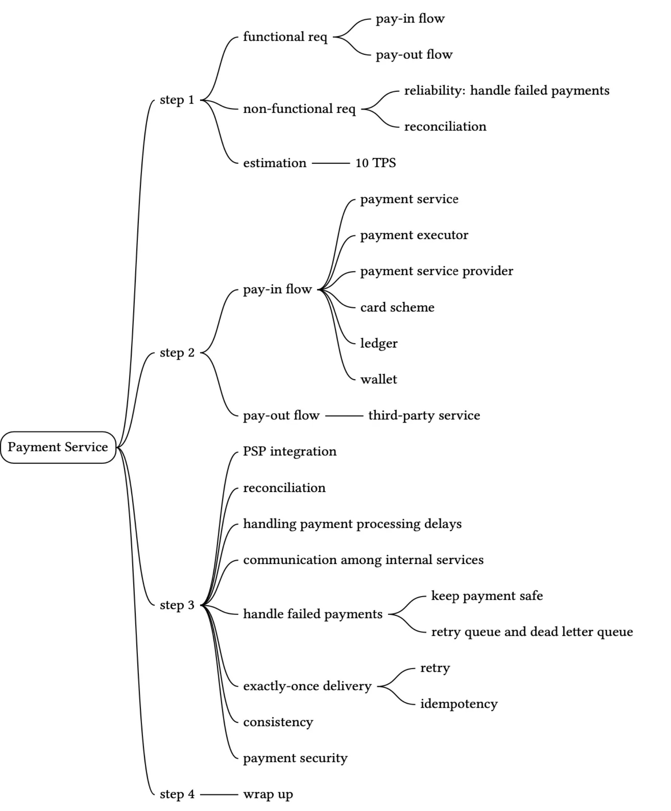

# 27. Payment system

[flowchart](https://rickzhou905616.invisionapp.com/freehand/System-Design-i1JCui0WB)

## Step 1 - Understand the problem

  

### Functional Requirements
1. pay-in flow: payment system receives the money from customers on behalf of sellers
2. pay-out flow: payment system sends mony to sellers around the world

### Non-functional Requirements
1. reliability and fault tolerance. failed payments need to be carefully handled
2. a reconciliation process between internal services (payment systems, accouting systems) and external services(payment service providers) is required. the process asynchronously verifies that the payment information across these systems is consistent

### back-of-the-envelope estimation
1. 1 million txn per day. 10^6 / 86400 = ~12 txn per second. 
    - 12 txn per second is not high for a typical database. 
    - focus of this system design is on how to correctly handle payment txns, ranther than aiming for high throughput

   

## Step 2 - Propose high-level design and get buy-in

### API

### Datamodel
- performance is not the most important factor, instead
    1. Proven stability
    2. richness of supporting tools such as monitoring and investigation tools
    3. maturity of the database administrator job market

### double-entry ledger system
1. records every payment txn into two separate ledger acccounts with same amount

### Hosted payment page
1. not store credit card info, otherwise it will deal with PCI DSS(payment card industry data security standard) compliance issue
2. use widget or iframe to load page inside a page
3. PSP (payment service provider) provised a hosted payment page to captures cusomter card info directly rather than relying on our payment service

### pay-out flow
1. use 3rd pay-out provider to move money from e-commerce web bank account to seller's bank account

   

## Step 3 - Design Deep Dive

### PSP integration
### reconciliation
### handling payment processing delays
### communication among internal services
### handling failed payments
### exact-once delivery
### consistency
### security

   

## Step 4 - Wrap up
