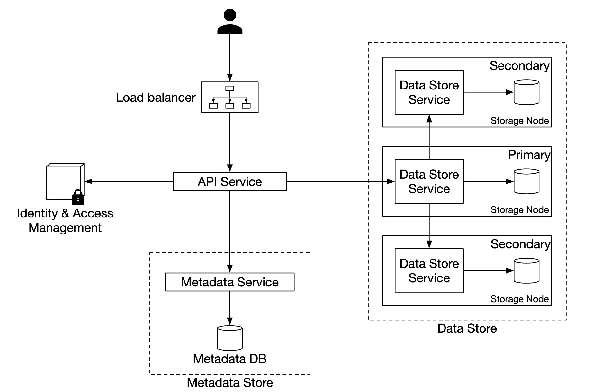

# systemdesign_alex_v2
the 2nd phrase of the system design

# points summarization

- For a read-heavy system, a relational database such as MySQL can be a good fit

## 1. QPS and web server
- [link](https://medium.com/@lingyong/qps-and-web-server-database-relationship-reference-system-design-interview-f9f27879c961)
- one web server handles 1K QPS
- one SQL db (mysql/ postgreSQL) handles 1K QPS if the query is complicated with JOIN, the number could be lower
    - 50,000 simple QPS, 
- one NoSQL db (MongoDB/ Cassandra) handles 10K QPS
- one NoSQL db (Redis/ Memcached) handles 1M QPS

## 2. reliability
1. data replicas to ensure data reliability
2. use some consensus algo or consensus-based distributed db to ensure data consistency

## 3. how to solve hot parition


<br><br><br><br><br><br>


# 17. Proximity service 
- A proximity service is used to discover nearby places such as restaurants, hotels, theaters, musuems, etc., and is a core component that powers features like finding the best restaurant nearby on Yelp or finding k-nearest gas stations on Google maps.
    - 

<br><br><br>

## Step 1 - Understand the problem and establish design scope


<br><br><br>

## Step 2 - Propose high-level design and get buy-in

<br><br><br>

## Step 3 - Design Deep Dive

<br><br><br>

## Step 4 - Wrap up


<br><br><br><br><br><br>

# 20. Distributed email service


<br><br><br><br><br><br>


# 25 S3-like Object Storage
- S3 - Amazon Simple Storage Service, provide object storage through RESTful API-based interface

<br><br><br>

## storage system 101

### block storage

### file storage

### ojbect storage

<br><br><br>

## Terminology
1. bucket
2. object
3. versioning
4. uniform resource identifier (URI)
5. service-level argreement (SLA)

<br><br><br>

## step 1 - Understand the problem and establish design scope

### 1.1 non-functional requirements
1. data durability 6 nines
2. service availability 4 nines
3. 100 PB of data in a year 1PB = 10^3TB = 10^6 GB = 10^9 MB
4. sotrage efficienc

### 1.2 back-of-the-envelope estimation
1. object storage has bottleneck in either `disk capacity` or `disk IO per second (IOPS)`
- Disk capacity
    - 20% small     x < 1MB
    - 60% medium    1MB <= x < 6MB
    - 20% large     x > 64MB
- IOPS
    - one hard disk 7200 rpm (rotaiton per minute), 100~150 random seeks per second(100 - 150 IOPS)

2. calculation
    - use median size for each object type (0.5 MB for small objects, 32 MB for medium objects, 200 MB for large objects)
    - with 40% storage usages ratio
    - 100 PB = 100 * 1000 * 1000 * 1000 = 10^11 MB
    - 10^11 * 0.4 / (0.2 * 0.5 MB + 0.6 * 32MB + 0.2 * 200 MB) = 0.68 billion objects
    - if we assume metadata of an object is about 1KB in size, we need 0.68 TB (0.68 * 10^9 * 1KB) space to store all metadata information

<br><br><br>

## step 2 - Propose high-level design and get buy-in

1. object immutability
2. key-value store
3. write once, read many times (95% is to read) (master-slave)
4. support both small and large objects
    - unix: inode -> hard disk block    
    - object store: metastore -> object id -> dataStore
        - 

    - we can separate metadata store and data store
        - 

<br><br>

### High-level design
- 

#### 1. uploading an ojbect
1. object_name, object_id, bucket_id


#### 2. downloading an object
1. a bucket has no directory hierarchy, but we can create a logical hierarchy by concatenating
2. fetch object_id(UUID), download object from data store via object_id(UUID)

#### 3. object versioning and listing objects in a bucket


<br><br><br>

## Step 3 - Design Deep Dive

### 3.1 data store
1. Data routing service
    - what is gRPC
2. placement service
    - multiple replicas, key to `high durability`
3. data node

#### 3.1.1 Data persistence flow
- 

#### 3.1.2 how data is organized
1. disk block has 4KB block, if too many small file, it waste a lot of space
    - merge small objects into a larger file. write-ahead log (WAL)

#### 3.1.3 object lookup
- use relational db, good performane for read (SQLite)
    - 

#### 3.1.4 updated data persistence flow
- 

<br><br><br>

#### 3.1.5 durability
##### 3.1.5.1 hardware filaure and failure domain
- hard drive annual failure rate 0.81%
    - replicate 3 times 1 - (0.0081)^3 = 0.999999 reliability
- data center split into differnt AZ(availablity zone)
    - 

##### 3.1.5.2 erasure coding
1. to fix data durability at comparable storage cost

##### 3.1.5.3 Correctness verification
1. to solve data corruption


<br><br>

### 3.2 metadata data model

### 3.2.1 Schema
1. query1: find the object id by object name
2. query2: insert and delete an object based on the object name
3. query3: list objects in a bucket sharing the same prefix
    - 
    

- shard by a combination of bucket_name + object_name, use hash of the (bucket_name, object_name) as the sharding key

<br><br>

### 3.3 listing objects in a bucket
- listing a bucket by prefix limits the results to only those object names that begin with the prefix

### 3.3.1 single database
```sql
SELECT * FROM bucket WHERE owner_id={id}
SELECT * FROM object WHERE bucket_id = "123" AND object_name LIKE `abc/%`
```

### 3.3.2 distributed databases
```sql
-- run query on all shards
SELECT * FROM object WHERE bucket_id = “123” AND object_name LIKE `a/b/%`

-- implement pagination is a little bit tricky
SELECT * FROM object WHERE
bucket_id = "123" AND object_name LIKE `a/b/%`
ORDER BY object_name OFFSET 0 LIMIT 10

-- for next page thoerticially
SELECT * FROM metadata
WHERE bucket_id = "123" AND object_name LIKE `a/b/%`
ORDER BY object_name OFFSET 10 LIMIT 10

-- as they are distributed, we can not guarantee the order

```

<br><br>

### 3.4 object versioning
- to avoid accidental deletion or overwriting of objects
    - 

- verisoning metadata
    - 

- deletion metadata
    - 


<br><br>

### 3.5 optimizing uploads of large files
- split large files into smaller chunks, then upload them independently. after all parts are uploaded, assembles the object from the parts. `multipart upload`

- checksum to verify that part is uploaded correctly
    - 


<br><br>

### 3.6 garbage collection
- auto-delete objects that are no longer needed
    - lazy object deletion
    - orphan data
    - corrupted data


<br><br><br>

## Step 4 - Wrap up
1. step1
    - functional requirements
        - api 
    - non functional requirements
        - data durability
        - service availability
        - storage efficiency

2. step2 
    - HLD
3. step3
    - deep dive

4. step4
    - wrap up
- 


<br><br><br><br><br><br>


# Netflix system design


## 1. open connect
    - non-streaming -> AWS
    - streaming -> openConnection (CDN)
        - bandwidth consumed by the video streaming
        - latency due to the long distance

## 2. backend


## 3. client
    - mobile
    - TV
    - PCs

1. new movie
    - uploading to aamzon s3
    - netflix convert orginal to different format/ resolution

2. push to differnt CDN servers
    

3. Zuul
    - API gateway

4. hystrix
    - 